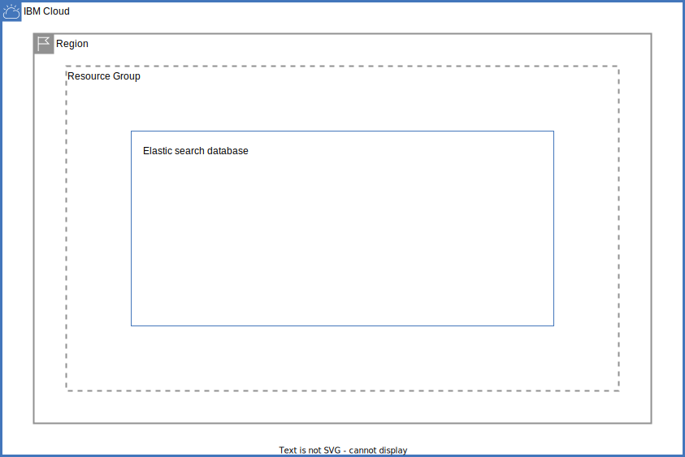

# IBM Elastic search fscloud on IBM Cloud

This architecture creates an IBM Elastic search fscloud instance in IBM Cloud  environment and supports provisioning the following resources:

- A resource group, if one is not passed in.
- An IBM Elastic search fscloud instance on IBM Cloud
- A IBM Elastic search database

